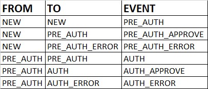

In this project we are using these States :
NEW, PRE_AUTH, PRE_AUTH_ERROR, AUTH, AUTH_ERROR

And these Events :
PRE_AUTH, PRE_AUTH_APPROVE, PRE_AUTH_ERROR, AUTH, AUTH_APPROVE, AUTH_ERROR

The transitions can be :
